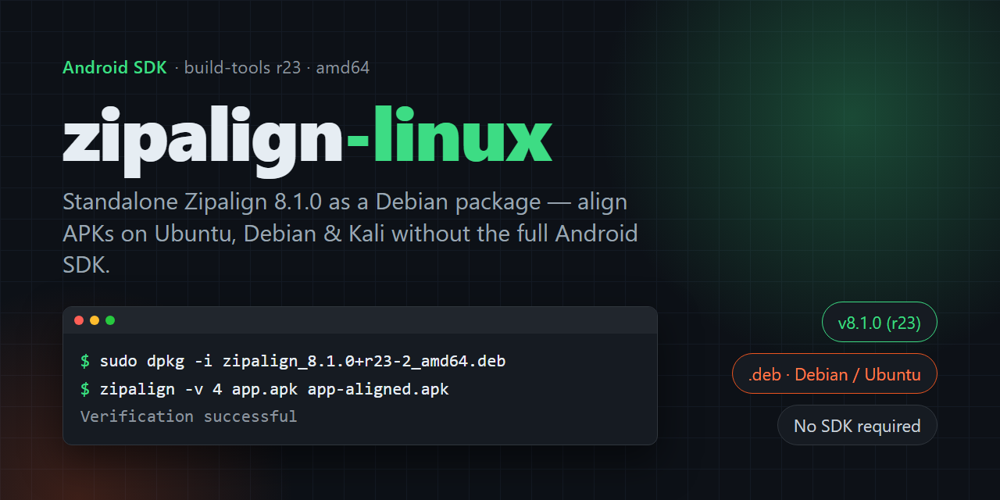

# zipalign-linux

Precompiled Debian package for Zipalign 8.1.0 (r23) — an Android SDK tool used to optimize and align APK files for efficient memory usage and faster performance. This .deb package allows you to easily install and use Zipalign on Ubuntu/Debian-based systems without requiring the full Android SDK.

📦 About This Package

Zipalign is an official Android SDK utility that ensures all uncompressed data within an APK is aligned on 4-byte boundaries. This alignment significantly improves application performance and reduces memory usage on Android devices.

This repository provides a prebuilt .deb package of Zipalign v8.1.0 (r23) for 64-bit Debian/Ubuntu systems, making installation fast and simple — no need for the full Android build tools.

⚙️ Features

✅ Ready-to-install .deb package (no manual setup)

⚡ Command-line compatible with Android SDK tools

🧩 Works with adb, apksigner, and other Android utilities

🐧 Built for Debian-based distributions (Ubuntu, Kali, etc.)

🧠 Lightweight, no dependencies beyond coreutils
